# 一文读懂Java并发编程

> 作者: 潘深练
>
> 更新: 2022-03-19


## 前言

了解Java并发编程之前，我们先说几个概念：

- JVM内存结构
- 对象的创建
- 对象的结构
- 线程
- 线程状态
- 线程池
- 线程池主要处理流程

并发编程问题的 **基本特性** 我们归为两部分：

> 安全性

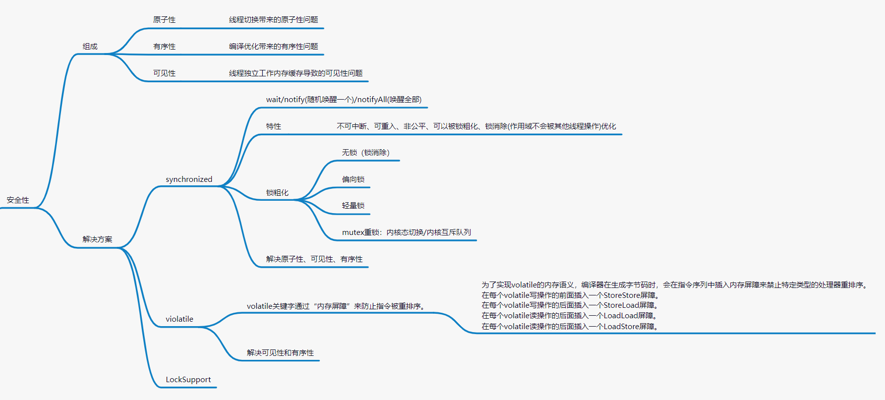

> 活性

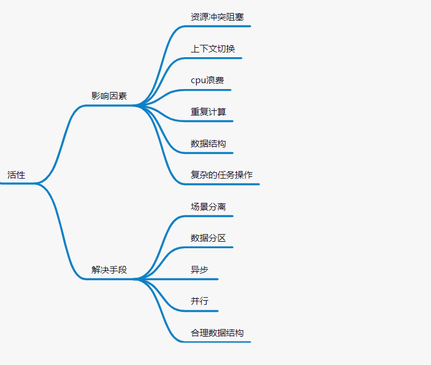

对于 `安全性` 问题，在并发编程中我们肯定是必须保证的。我们主要从组成方面去了解，例如像 `原子性`、`有序性`、`可见性`，保障安全性的解决方案基本像 `synchronized`、`violatile`、`LockSupport`等，我们会有专门的内容详细分析。

而提高 `活性` 问题，处理方式是有成本的，根据实际业务场景中，权衡抉择算法和方案，要么从实现复杂度层面考虑、要么从内存空间利用层面考虑，无论是站在 GC 的角度、还是说众多 JUC （并发工具包，例如还有 Guava、Hutool等）的角度来说，都有很多手段来提高 `活性` ，例如像读写分离、分段、减少冲突、异步、并行、合理的数据结构等，并清楚了解哪些因素会影响到 `活性`，例如像上下文切换、资源冲突、重复计算、cpu浪费、数据量等。

## JVM内存结构 

具体可以参考 JVM 虚拟知识文档的内容：

-  [JVM整体架构](http://jvm.panshenlian.com/#/zh-cn/02-jvm-framework)
-  [JVM运行时内存](http://jvm.panshenlian.com/#/zh-cn/02-jvm-runtime-memory)

## 对象的创建

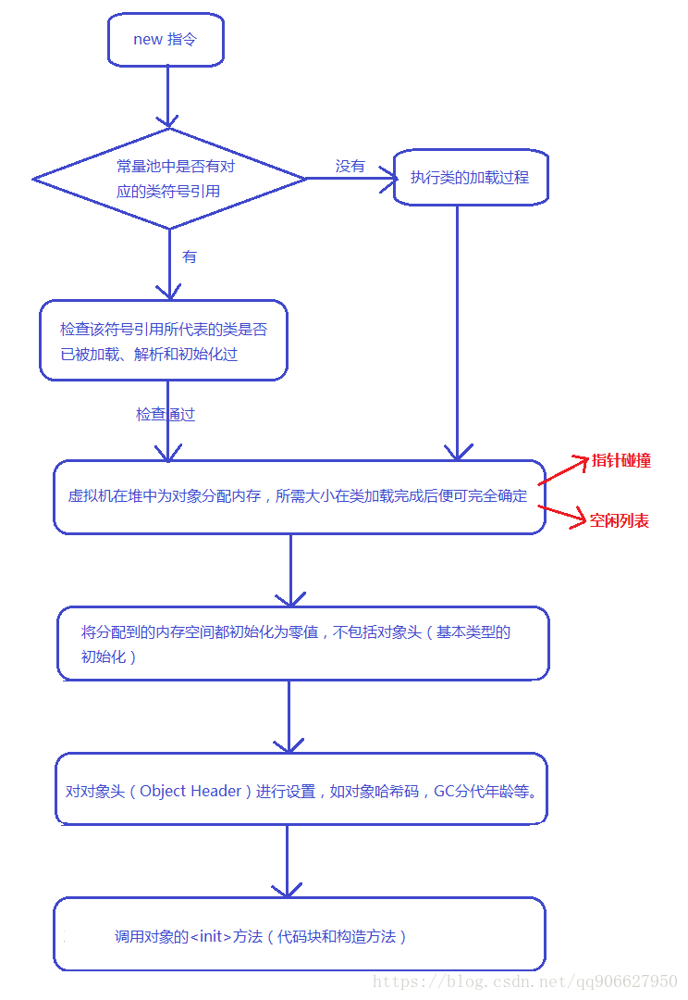

## 对象的结构

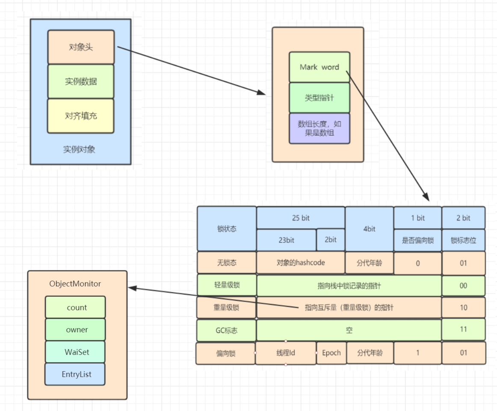

## 线程

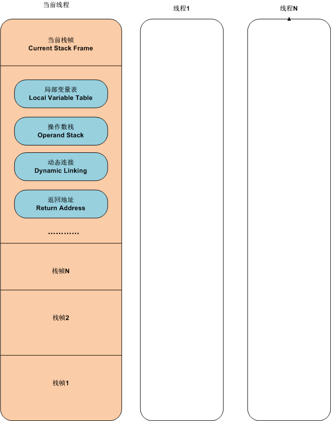

## 线程状态

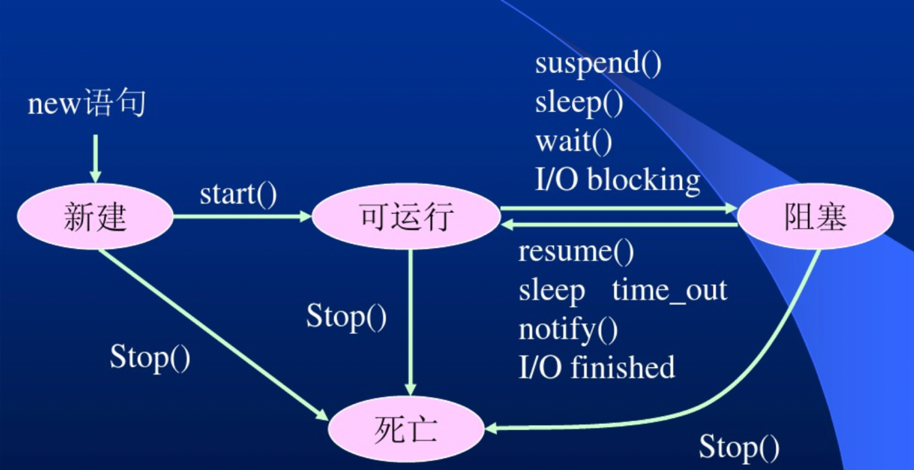

```java
public enum State{
    // 新生
    NEW,

    // 运行
    RUNNABLE,

    // 阻塞
    BLOCKED,

    // 等待
    WAITING,

    // 超时等待
    TIMED_WAITING,

    // 终止
    TERMINATED;

}
```

blocked 状态指的是synchronized和进行系统调用，通过操作系统挂起线程后，线程的状态。而 waiting 状态则不需要进行系统调用，是一种 JVM 层面的线程阻塞后的状态，sleep，locksupport。另外 timed_waiting 带时间上限，也是JVM层面的等待。

## 线程池

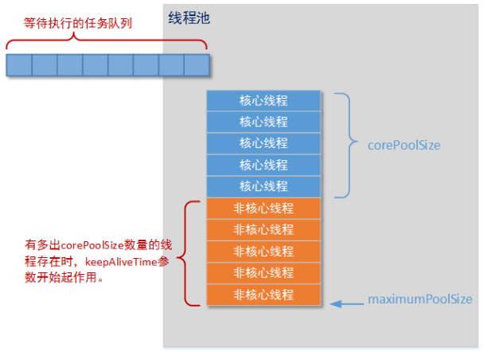

```java
public ThreadPoolExecutor (
    int corePoolSize,
    int maximumPoolSize,
    long keepAliveTime,
    TimeUnit unit,
    BlockingQueue<Runnable> workQueue,
    ThreadFactory threadFactory,
    RejectedExecutionHandler handler
){
    // ...
}
```

线程池的组成：

- 线程工厂
- 线程管理：核心线程数、最大线程数
- 任务队列：拒绝策略、有界/无界


## 线程池主要处理流程

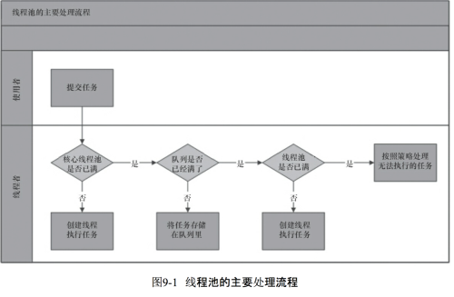

## 参与对象

在并发编程中参与对象基本包括：`控制流` 和 `数据` 。

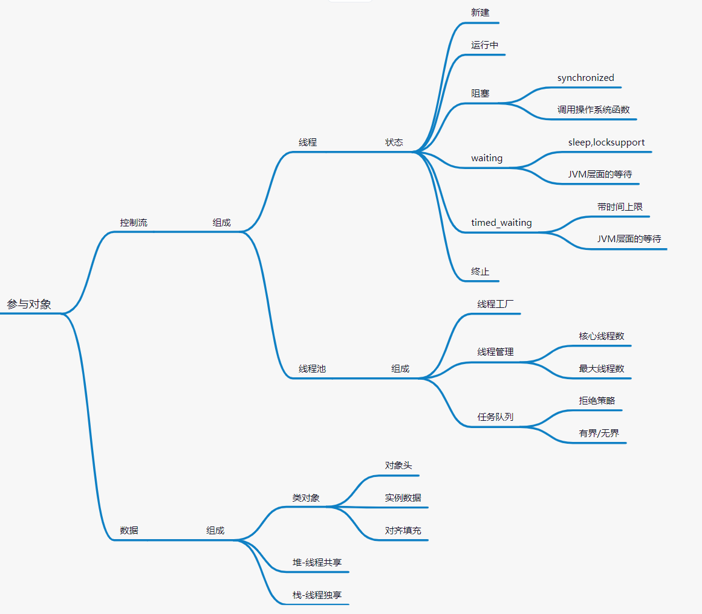

控制流的组成是 **线程** 和 **线程池**，而数据的组成是 **类对象**，**堆-线程共享**，**栈-线程独享**，其中 **类对象**包括对象头、实例数据以及对象填充。


## 安全性

安全性问题组成：有序性、原子性、可见性

> 有序性

编译优化带来的有序性问题。

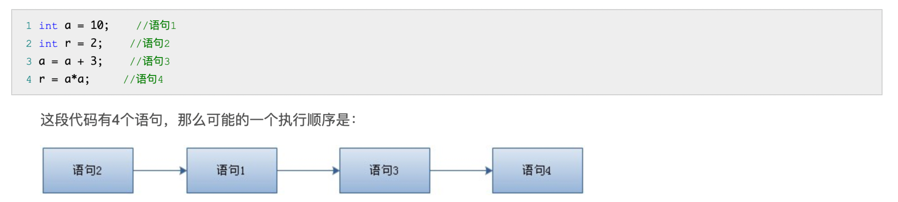

> 原子性

线程切换带来的原子性问题。

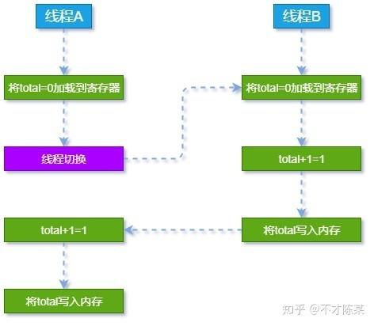

> 可见性

线程独立工作内存缓存导致的可见性问题。

在多线程并发编程中 `synchronized` 和 `volatile` 都扮演着重要的角色， `volatile` 是轻量级的 `synchronized` ，它在多处理器开发中保证了共享变量的 “可见性”。

**有 `volatile` 变量修饰的共享变量**，进行写操作的时候回多出 lock# 汇编代码。
通过查 `IA-32` 架构软件开发者手册可知，Lock 前缀的指令在多核处理器下会引发2件事情：

1. **将当前处理器缓存行的数据写回到系统内存。**

LOCK前缀指令执行期间，处理器可以独占任何共享内存（即锁住总线，导致其他cpu不能访问总线，不能访问总线意味着不能访问系统内存）。但是，在最近的处理器中，LOCK#信号一般不锁总线，而是锁缓存，毕竟锁总线开销比较大。

2. **这个写回内存的操作会使在其他CPU里缓存了该内存地址的数据无效。** 

`IA-32`处理器和`Intel64`处理器使用 `MESI` （修改、独占、共享、无效）控制协议去维护内部缓存和其他处理器缓存的一致性。在多核处理器系统中进行操作的时候，`IA-32`和`Intel64`处理器能嗅探其他处理器访问系统内存和他们的内部缓存。处理器使用 **嗅探技术** 保证它的内部缓存、系统内存和其他处理器的缓存的数据在总线上保持一致。例如，在 `Pentium` 和 `P6 family` 处理器中，如果通过嗅探一个处理器来检测其他处理器打算写内存地址，而这个地址当前处于 **共享状态**，那么正在嗅探的处理器将使它的缓存行无效，在下次访问相同内存地址时，强制执行缓存行填充。

```text
Q: volatile 的使用优化方式？
A: 可在部分处理器中追加64字节能够提高并发编程效率！
```

更多关于 [volatile](../zh-cn/02-Java-Volatile-Keyword.md) 

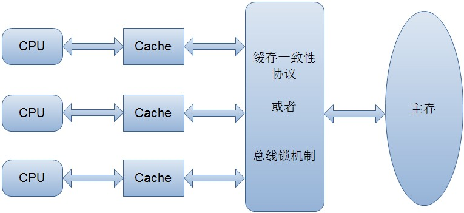

**关于 happens-before**

1. 程序顺序规则：一个线程中的每个操作，happens-before于该线程中的任意后续操作。
2. 监视器锁规则：对一个锁的解锁，happens-before于随后对这个锁的加锁。
3. volaatile 变量规则：对一个 volatile 域的写，happens-before 于任意后续对这个 volatile 域的读。
4. 传递性：如果A happens-before B，且B happens-before C，那么 A happens-before C。
5. start()规则：如果线程A执行操作 ThreadB.start()（启动线程B），那么A线程的 ThreadB.start() 操作 happens-before 于线程B中的任意操作。
6. Join()规则：如果线程A执行操作ThreadB.join()并成功返回，那么线程B中的任意操作 happens-before 于线程A从ThreadB.join() 操作成功返回。
7. 程序中断规则：对线程 interrupted() 方法的调用先行与被中断线程的代码检测到中断时间的发生。
8. 对象finalize规则：一个对象的初始化完成（构造函数执行结束）先行与发生它的finalze() 方法的开始。

## 安全性解决方案

### 1、synchronized 

> wait/notify (随机唤醒一个)/notifyAll（唤醒全部）

> 特性

不可中断、可重入、非公平、可以被锁粗化、锁消除（作用域不会被其他线程操作）优化

> 锁粗化（锁升级）

- 无锁（锁消除）
- 偏向锁
- 轻量锁
- mutex重锁：内核态切换/内核互斥队列

> 解决原子性、可见性、有序性

### 2、violatile

> volatile 关键字通过 “内存屏障” 来防止指令被重排序。

为了实现 volatile 的内存语义，编译器在生成字节码时，会在指令序列中插入内存屏障来禁止特定类型的处理器重排序。
- 在每个 volatile 写操作的前面插入一个 StoreStore 屏障。
- 在每个 volatile 写操作的后面插入一个 StoreLoad 屏障。
- 在每个 volatile 读操作的后面插入一个 LoadLoad 屏障。
- 在每个 volatile 读操作的后面插入一个 LoadStore 屏障。

> 解决可见性和有序性

关于 volatile 对线程的安全性说明：

- **可见性**。 对一个 volatile 变量的读，总是能看到（任意线程）对这个 volatile 变量最后的写入。
- **有序性**。很简单一点就是 volatile 通过内存屏障，规避了编译器和处理器某些不正确的重排序。
- ~~原子性~~。对任意单个 volatile 变量的读/写具有原子性，但类似于 volatile++ 这种复合操作不具有原子性。
    - 例如 volatile++ 在实际内存执行中被拆分成4步：
        - 1. volatile 读取值到 local
        - 2. 增加 volatile 变量的值
        - 3. 把 local 值写回
        - 4. 插入内存屏障
    - 所以在多线程并发的情况下，不能保证以上4步是具备原子操作的，中间可能会被其他线程插入污染。
    - 由于 volatile 仅仅保证对单个 volatile 变量的读/写具有原子性，而锁的互斥执行特性则可以确保对整个临界区代码的执行具有原子性。在**功能**上，锁比 volatile 更加强大；在**可伸缩性**和**执行性能**上，volatile 则更有优势。假如真希望在程序中用 volatile 代替锁，请一定谨慎使用。

**重排序**，指的是编译器（编译重排序）和处理器（指令并行重排序和内存重排序）为了优化程序性能而对指令序列进行重新排序的一种手段。

> 锁释放/获取的内存语义与 volatile 写/读的内存语义相同

1. 锁释放与 volatile 写有相同的内存语义：即JMM会把改线程对应的本地内存中的共享变量**刷新到主内存**中。
2. 锁获取与 volatile 读有相同的内存语义：即JMM会把改线程对应的本地内存**置为无效**。

### 3、LockSupport

## 活性

### 1、影响活性的因素

> 资源冲突阻塞
> 上下文切换
> cpu浪费
> 重复计算
> 数据结构
> 复杂的任务操作

### 2、提高活性的解决手段

> 场景分离
> 数据分区
> 异步
> 并行
> 合理数据结构

## 待梳理问题：

1. 由ReentrantLock引出的公平锁与非公平锁问题
2. 脑图梳理，结合`p55`与`JUC脑图`统一梳理。（基于**并发机制底层实现原理**与**Java内存模型(可见性)**），锁、synchronized、volatile、final..（针对所有这些域的重排序规则和可见性问题，统一梳理）


## 参考

- [《JSR-133 Java Memory Model and Thread Specification 1.0 Proposed Final Draft》](https://download.oracle.com/otndocs/jcp/memory_model-1.0-pfd-spec-oth-JSpec/)
    - Java内存模型经典JSR

- [《Time, Clocks, and the Ordering of Events in a Distributed System》](https://lamport.azurewebsites.net/pubs/time-clocks.pdf) 
    - Leslie Lamport 的论文，最早使用 happens-before 来定义分布式系统中事件之间的偏序关系（partial ordering）。


（本篇完）

?> 您也可以参与梳理，快来提交 [issue](https://github.com/senlypan/concurrent-programming-docs/issues) 或投稿吧~