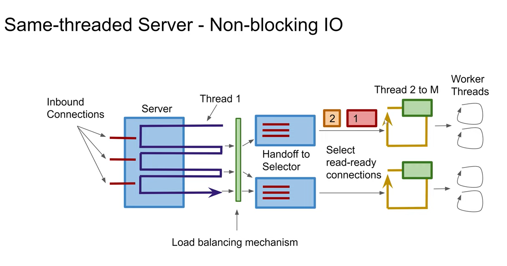

# 同线程


> 作者: 雅各布·詹科夫
>
> 原文: http://tutorials.jenkov.com/java-concurrency/same-threading.html  最后更新: 2022-02-23

同线程是一种并发模型，其中一个单线程系统横向扩展为 N 个单线程系统。结果是 N 个单线程系统并行运行。

同线程系统不是纯粹的单线程系统，因为它包含多个线程。但是每个线程都像单线程系统一样运行。因此，术语同线程而不是单线程。

## 单线程和同线程设计教程视频

如果您喜欢视频，这里有本教程对应的视频版本: [单线程和同线程设计](https://www.youtube.com/watch?v=QrYIOs1dA3M&list=PLL8woMHwr36EDxjUoCzboZjedsnhLP1j4&index=21)


**我强烈推荐** 大家去 YouTube 看英文原版的视频讲解（因为我翻译水平有限），这个视频从线程服务的角度分析了几类线程模型，比较清晰的讲解了他们之间的差异。很多IO模型的设计基本是参考了这几类线程模型，例如 Netty。

> Single-threaded Server 单线程服务


单线程的服务，同一时刻只能接收一个请求或处理一个请求，当一个单线程正在处理请求时，他是无法同时去接收另一个新请求的，除非它刚好处理完上一个请求，才能继续接收一个新请求。

```text
  单线程服务是阻塞的，accept方法会一直阻塞，直到有客户端请求的到来，
  并返回socket进行相应的处理。整个过程是流水线的，处理完一个请求，
  才能去获取并处理后面的请求。
```

> Two-threaded Server 双线程服务


双线程服务（不确定翻译的是否妥当），指的是两个线程1-1合作，一个线程用来接收请求，另一个线程用来处理请求。不过会存在一些问题，假如处理请求的这个线程花费了较长时间去处理请求（或者阻塞），那么接收请求的这个线程就算接收了一个新的请求，也不得不处于等待状态中，直到上一个请求被处理完，这个新的请求才能被处理线程开始处理。

> Multithreaded Server 多线程服务


由于双线程服务的不足，有了 Multithreaded Server （多线程服务），这种模型是多个线程1-N合作，一个线程用来接收请求并放入队列中，另外有N个线程（或者你理解为是一个线程池）从队列中领取请求并处理，处理效率明显提升了（不像  Two-threaded Server 会出现长时间等待的情况）。多线程服务设计适合处理短连接的请求，不适合处理像聊天服务这种长连接的场景。

```text
当然，处理线程不是越多越好，如果设置的处理线程过多，那么也会极大的造成系统性能浪费，
因为多个线程之间的上下文切换是非常耗费性能的，每个线程也都需要占用很多内存资源。
```

> Two-threaded Server - Non-blocking IO 


非阻塞的双线程服务，这个设计上添加了一个 Selector（选择器），Selector是NIO实现的核心，他会不断轮询请求，而不是阻塞性的让一个线程一直处于等待接入的状态，一旦Selector检测到有请求接入、读或者写，才会进行后续对应的IO操作。

当然，非阻塞的双线程服务会出现两个问题：
1. 单个请求处理线程可能无法利用服务器中的所有cpu核
2. 处理线程依然会出现阻塞

> Same-threaded Server - Non-blocking IO

 

所以，非阻塞的同线程服务会更加合理，增加了 Selector ，添加了负载均衡机制，而且处理线程只负责委派任务，具体的任务执行交由工作线程处理。

## 为什么选择单线程系统？

您可能想知道为什么今天有人会设计单线程系统。单线程系统之所以受欢迎，是因为它们的并发模型比多线程系统简单得多。单线程系统不与其他线程共享任何状态（对象/数据）。这使得单线程可以使用非并发数据结构，并更好地利用 CPU 和 CPU 缓存。

不幸的是，单线程系统没有充分利用现代 CPU。现代 CPU 通常带有 2、4、6、8 个以上的内核。每个内核都作为一个单独的 CPU 运行。单线程系统只能使用其中一个内核，如下所示：


## 同线程：单线程横向扩展

为了利用 CPU 中的所有内核，可以横向扩展单线程系统以利用整个计算机。

### 每个 CPU 一个线程

同线程系统通常在计算机中每个 CPU 运行 1 个线程。如果一台计算机包含 4 个 CPU，或者一个具有 4 个内核的 CPU，那么正常会运行相 4 个同线程系统实例（4 个单线程系统）。下图展示了这一原理：


## 没有共享状态

同线程系统看起来类似于传统的多线程系统，因为同线程系统内部运行着多个线程。但是有一个细微的差别。

同线程系统与传统多线程系统的区别在于同线程系统中的线程不共享状态。没有线程并发访问的共享内存。没有线程共享数据的并发数据结构等。此处说明了这种差异：


缺少共享状态使得每个线程的行为都像单线程系统一样。但是，由于同一线程系统可以包含多个线程 - 它并不是真正的“单线程系统”。由于没有更好的名称，我发现将这样的系统称为同线程系统更准确，而不是“具有单线程设计的多线程系统”。同线程更容易说，也更容易理解。

同线程基本上意味着数据处理保持在同一个线程中，并且同线程系统中的任何线程都不会同时共享数据。有时这也被称为 无共享状态并发，或单独的状态并发。

## 负载分配

显然，同线程系统需要在运行的单线程实例之间分担工作负载。如果只有一个线程可以工作，那么系统实际上是单线程的。

究竟如何在不同线程上分配负载取决于系统的设计。我将在以下部分中介绍一些内容。

### 单线程微服务

如果您的系统由多个微服务组成，则每个微服务都可以以单线程模式运行。当您将多个单线程微服务部署到同一台机器时，每个微服务可以在单个 CPU 上运行单个线程。

微服务本质上不共享任何数据，因此微服务是同线程系统的一个很好的用例。

### 分片数据服务

如果您的系统确实需要共享数据，或者至少需要共享数据库，您可以对数据库进行分片。分片意味着数据在多个数据库之间进行划分。数据通常被划分，以便彼此相关的所有数据一起位于同一数据库中。例如，属于某个“所有者”实体的所有数据都将插入到同一个数据库中。但是，分片超出了本教程的范围，因此您必须搜索有关该主题的教程。

## 线程通信

如果同一线程系统中的线程需要通信，它们通过消息传递来实现。如果线程 A 想要向线程 B 发送消息，线程 A 可以通过生成消息（字节序列）来实现。然后线程 B 可以复制该消息（字节序列）并读取它。通过复制消息，线程 B 确保线程 A 在线程 B 读取消息时不能修改消息。复制后，线程 A 无法访问消息副本。

通过消息传递的线程通信如下所示：


线程通信可以通过队列，管道，Unix sockets, TCP sockets 等等。根据您的系统需要做选择即可。

## 更简单的并发模型

在同线程系统中运行在自己线程中的每个系统都可以像单线程一样实现。这意味着内部并发模型比线程共享状态要简单得多。您不必担心并发数据结构以及此类数据结构可能导致的所有并发问题。

## 插图

以下是单线程、多线程和同线程系统的图解，您可以更轻松地了解它们之间的区别。

第一个插图显示了一个单线程系统。


第二个插图显示了一个多线程系统，其中线程共享数据。


第三幅图显示了一个同线程的系统，它有 2 个具有不同数据的线程，通过相互传递消息进行通信。


## Java的线程操作

Thread Ops for Java 是一个开源工具包，旨在帮助您更轻松地实现不同状态的同线程系统。这个开源工具包包含用于启动和停止单个线程以及在单个线程中实现某种程度并发的工具。如果您对使用相同线程的应用程序设计感兴趣，那么看看这个开源工具包，可能会很适合你，你可以在我的 [Thread Ops in my Thread Ops for Java Tutorial](http://tutorials.jenkov.com/thread-ops-java/index.html) 教程中阅读更多有关开源工具包的信息。

（本篇完）

?> ✨ 译文来源：[潘深练](https://www.panshenlian.com) 如您有更好的翻译版本，欢迎 ❤️ 提交 [issue](https://github.com/senlypan/concurrent-programming-docs/issues) 或投稿哦~


